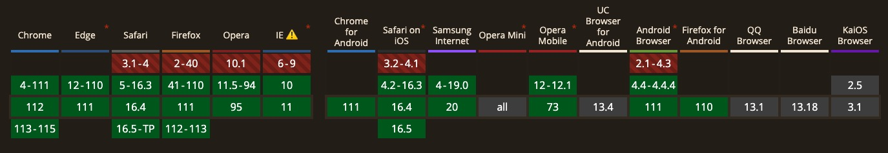

# ExcelsiorChannel

基于JSON-RPC 2.0协议的通信工具。用于浏览器多窗口之间的通信。

- 支持消息延迟通信（在连接建立之前，所有的消息发送都会被缓存，直到连接创建成功）。
- 支持与本地函数一致的调用方式。
- 支持控制台打印请求过程。

## Browser Requirement



## Get Start

### MAIN WINDOW

```ts
import { MainPoint } from '@lihzsky/excelsior-channel';

const frame = document.body.getElementsByTagName('iframe')[0];
const pointer = new MainPoint(frame);

// 定义远程调用的函数
pointer.declare('move', (targetIndex: number, relativeIndex: number) => {
  // move
  console.info('move success!', targetIndex, relativeIndex);
})

// 定义远程调用的函数
pointer.declare('delete', () => {
  // delete
  console.info('delete success!');
})

// 通知update操作
pointer.notify('update')
```

### IFRAME WINDOW/OTHER WINDOW

```ts
import { NodePoint } from "@lihzsky/excelsior-channel";

const pointer = new NodePoint();

// 定义远程调用的函数
pointer.declare('update', () => {
  // update
  console.info('update success!');
});

// 通知delete操作，删除指定内容
pointer.notify('delete', 1);

// 调用move操作，移动指定内容
// invoke的方式可以获取到返回的数据，用于下一步的操作
const data = await pointer.invoke('move', 1, 6);
```

## API

### Class

- MainPoint

> 主窗口创建端口，用于远程通信。

- NodePoint

> 子窗口创建端口，用于远程通信。

### Static Method

- wrap(endpoint: CorePoint): any

> 包裹端口封装。使消息发送与本地调用方式一致。
> **注意**：包裹端口后，底层调用方式只支持invoke，不支持notify。

```ts
import { MainPoint } from '@2dfire/excelsior-channel';

const frame = document.body.getElementsByTagName('iframe')[0];
const pointer = new MainPoint(frame);
const proxyPointer = MainPoint.wrap(pointer);

// 定义远程调用的函数
proxyPointer.move = (targetIndex: number, relativeIndex: number) => {
  // move
  console.info('move success!', targetIndex, relativeIndex);
}

// 定义远程调用的函数
proxyPointer.delete = () => {
  // delete
  console.info('delete success!');
}

// 通知update操作
proxyPointer.update();
```

### Method

- declare(method: string, fn: PointController): void

> 声明远程函数。窗口发送通知或请求时，另一个窗口会找到对应的函数，并执行该函数。

- notify(method: string, ...params: any[]): void

> 通知执行远程函数。用于通知另一个窗口执行对应的函数。

- invoke(method: string, ...params: any[]): Promise\<any\>

> 请求执行远程函数并返回结果。用于请求另一个窗口执行对应的函数，函数会返回的结果发送会窗口。

## Extra

- Journal是轻量级console类。可以自定义输出的环境，接入的环境API参考console。
